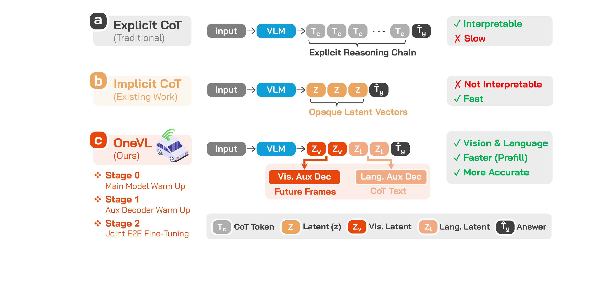
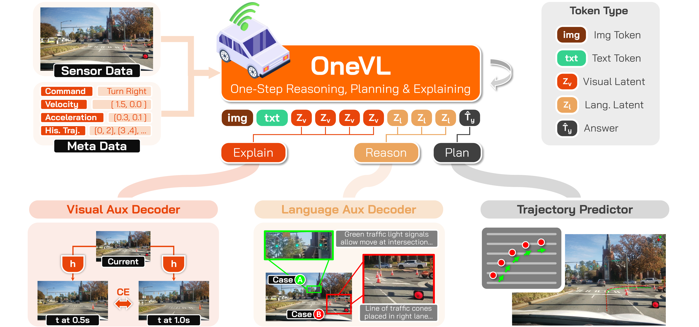
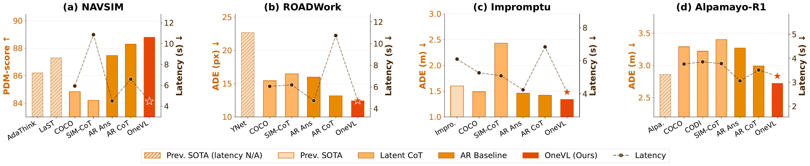
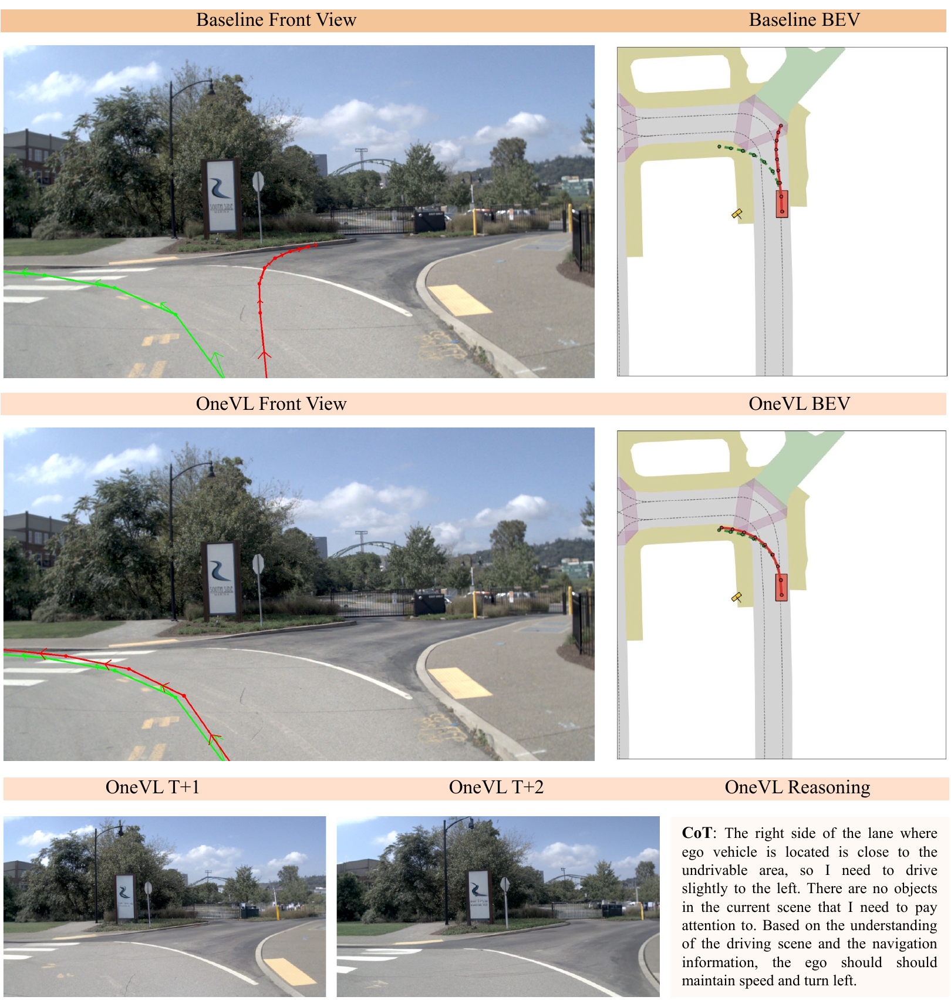
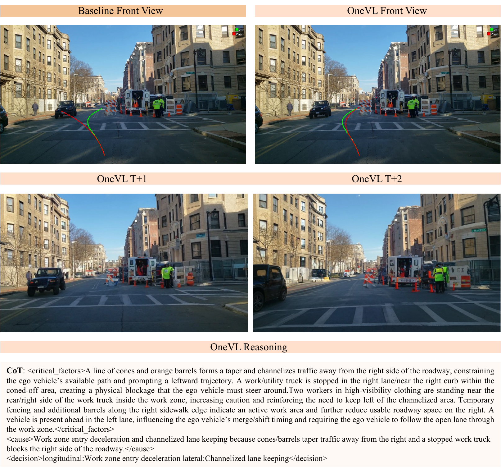

<div align="center">

#  OneVL: One-Step Latent Reasoning and Planning with Vision-Language Explanations

[](https://arxiv.org/abs/2604.18486/)
[](https://xiaomi-embodied-intelligence.github.io/OneVL/)
[](https://huggingface.co/collections/xiaomi-research/onevl-models/)
[](LICENSE)

</div>

---

## Overview

**OneVL** is a Vision-Language-Action (VLA) framework for autonomous driving that achieves **state-of-the-art trajectory prediction accuracy** with **inference latency matching answer-only AR models**. It overcomes the fundamental limitations of prior latent Chain-of-Thought (CoT) methods by introducing dual-modal auxiliary decoders that supervise compact latent tokens to encode both linguistic reasoning and future scene dynamics.

### Three CoT Paradigms

<div align="center">

</div>

> **(a) Explicit CoT** generates a full reasoning chain before the answer — interpretable but slow. **(b) Implicit CoT** compresses reasoning into opaque latent vectors — fast but not interpretable. **(c) OneVL (ours)** uses visual latent tokens `v` and language latent tokens `l`; during training, dual auxiliary decoders decode these into future frames and CoT text respectively. At inference, decoders are discarded and latents are **prefilled** into the prompt — matching the speed of (b) while recovering the interpretability of (a) in both vision and language.

### Architecture

<div align="center">

</div>

> During training, hidden states at visual latent positions are routed to the **Visual Aux. Decoder** (predicts future-frame visual tokens at t+0.5s and t+1.0s) and at language latent positions to the **Language Aux. Decoder** (reconstructs CoT text). Both decoders are discarded at inference; all latent tokens are **prefilled** into the prompt, matching answer-only AR prediction latency.

OneVL augments **Qwen3-VL-4B-Instruct** with:

- **Latent Token Interface** — 4 visual latent tokens + 2 language latent tokens placed in the assistant response before the answer, using existing vocabulary tokens (no new special tokens).
- **Visual Auxiliary Decoder** — Predicts future-frame visual tokens at t+0.5s and t+1.0s from visual latent hidden states (Emu3.5 IBQ, 131k codebook), acting as a **world model** supervision signal.
- **Language Auxiliary Decoder** — Reconstructs explicit CoT reasoning text from language latent hidden states, conditioned on ViT visual features.
- **Prefill Inference** — Both decoders are discarded at inference; latent tokens are processed in one parallel pass with only the trajectory generated autoregressively.

### Key Innovations

- **Dual-Modal Auxiliary Decoders**: A *language auxiliary decoder* reconstructs human-readable CoT reasoning from language latent tokens; a *visual auxiliary decoder* predicts future scene frames from visual latent tokens, acting as a **world model** that grounds the latents in physical scene dynamics.
- **Prefill Inference**: All latent tokens are prefilled into the prompt context in a single parallel pass — **1.5× faster than explicit CoT on NAVSIM, 2.3× faster on ROADWork** — with latency essentially identical to answer-only AR prediction.
- **Compression Drives Generalization**: OneVL is the **only latent CoT method that outperforms explicit autoregressive CoT** across all four benchmarks.

---

## Open-Source Status

| Component | Status |
|-----------|--------|
| 📄 Technical Report | ✅ Release |
| ⚖️ Model Weights | ✅ Release |
| 🔍 Inference Code | ✅ Release |
| 🏋️ Training Code | 🔜 Coming Soon |

---

## Results

### Accuracy–Efficiency Pareto (NAVSIM & ROADWork)

<div align="center">

</div>

> OneVL lands in the **green-shaded optimal corner** (lowest latency, best metric) on both benchmarks. All prior latent CoT methods (COCONUT, CODI, SIM-CoT) underperform even the AR Answer baseline on driving tasks — a critical failure that OneVL overcomes.

### NAVSIM — Full Comparison

| Method | Model Size | PDM-score ↑ | Latency (s) ↓ | Interpretability |
|--------|:----------:|:-----------:|:-------------:|:----------------:|
| AdaThinkDrive | 8B | 86.20 | — | Language |
| LaST-VLA | 8B | 87.30 | — | — |
| AR Answer | 4B | 87.47 | <u>4.49</u> | — |
| AR CoT+Answer | 4B | <u>88.29</u> | 6.58 | Language |
| COCONUT | 4B | 84.84 | 5.93 | — |
| CODI | 4B | 83.92 | 8.62 | — |
| SIM-CoT | 4B | 84.21 | 10.86 | Language |
| **OneVL** | **4B** | **88.84** | **4.46** | **Vision + Language** |

### ROADWork — Full Comparison

| Method | ADE (px) ↓ | FDE (px) ↓ | Latency (s) ↓ | Interpretability |
|--------|:----------:|:----------:|:-------------:|:----------------:|
| YNet | 22.68 | 80.78 | — | — |
| AR Answer | 15.98 | 40.29 | <u>4.74</u> | — |
| AR CoT+Answer | <u>13.18</u> | <u>29.98</u> | 10.74 | Language |
| COCONUT | 15.44 | 38.60 | 6.06 | — |
| CODI | 16.45 | 44.28 | 6.73 | — |
| SIM-CoT | 16.49 | 44.32 | 6.19 | Language |
| **OneVL** | **12.49** | **28.80** | **4.71** | **Vision + Language** |

### Impromptu — Full Comparison

| Method | ADE (m) ↓ | FDE (m) ↓ | Latency (s) ↓ | Interpretability |
|--------|:---------:|:---------:|:-------------:|:----------------:|
| Impromptu VLA | 1.60 | 4.28 | 6.10 | — |
| AR Answer | 1.46 | 4.03 | <u>4.24</u> | — |
| AR CoT+Answer | <u>1.42</u> | <u>3.96</u> | 6.84 | Language |
| COCONUT | 1.49 | 4.07 | 5.27 | — |
| CODI | 1.86 | 5.18 | 5.24 | — |
| SIM-CoT | 2.43 | 6.10 | 5.09 | Language |
| **OneVL** | **1.34** | **3.70** | **4.02** | **Vision + Language** |

### APR1 — Full Comparison

| Method | ADE (m) ↓ | FDE (m) ↓ | Latency (s) ↓ | Interpretability |
|--------|:---------:|:---------:|:-------------:|:----------------:|
| Cosmos-Reason | <u>2.86</u> | **7.42** | — | Language |
| AR Answer | 3.27 | 9.59 | 3.06 | — |
| AR CoT+Answer | 2.99 | 8.54 | 3.51 | Language |
| COCONUT | 3.29 | 9.48 | 3.76 | — |
| CODI | 3.22 | 9.25 | 3.85 | — |
| SIM-CoT | 3.40 | 9.85 | 3.78 | Language |
| **OneVL** | **2.62** | <u>7.53</u> | **3.26** | **Vision + Language** |

### Text CoT Quality (NAVSIM)

| Method | Meta Action Acc. ↑ | STS Score ↑ | LLM Judge ↑ | Avg. ↑ | Latency (s) ↓ |
|--------|:-----------------:|:-----------:|:-----------:|:------:|:------:|
| AR CoT+Answer | 73.20 | 79.75 | 81.86 | **78.27** | <u>6.58</u> |
| SIM-CoT | 67.20 | 76.25 | 78.73 | 74.06 | 10.86 |
| **OneVL** (lang. aux.) | 71.00 | 78.26 | 79.13 | <u>76.13</u> | **4.46** |

OneVL's language auxiliary decoder recovers 97% of explicit CoT quality while running at answer-only speed.

### Ablation Study (NAVSIM PDM-score)

| Model Variant | Lang. Aux. Dec. | Vis. Aux. Dec. | Staged Train | PDM-score ↑ |
|---------------|:---------------:|:--------------:|:------------:|:-----------:|
| OneVL w/o vis. dec. | ✓ | — | ✓ | 87.97 |
| OneVL w/o lang. dec. | — | ✓ | ✓ | 88.53 |
| OneVL w/o staged train | ✓ | ✓ | — | 67.13 |
| **OneVL (full)** | **✓** | **✓** | **✓** | **88.84** |

Both auxiliary decoders contribute measurably; staged training is essential (without it, performance collapses to 67.13).

---

## Qualitative Examples

### NAVSIM

<div align="center">

</div>

> Each plot overlays ground-truth (green) and predicted (red) trajectories on the front camera view, along with predicted future frames at t+0.5s and t+1.0s decoded from the visual auxiliary decoder, and the language CoT from the language auxiliary decoder.

### ROADWork (Construction Zone Navigation)

<div align="center">

</div>

---

## Environment Setup

**Requirements:** Python 3.10+, CUDA GPU (≥16 GB VRAM recommended for inference with aux decoders).

```bash
# 1. Create and activate virtual environment
uv venv venv/onevl --python 3.12
source venv/onevl/bin/activate

# 2. Install dependencies
pip install -r requirements.txt
```

Core packages (`requirements/framework.txt`):

```
transformers>=4.57.0,<5.4.0   # Qwen3VLForConditionalGeneration requires ≥4.57.0
trl>=0.15,<0.29
peft>=0.11,<0.19
deepspeed<0.19
qwen_vl_utils
timm
datasets>=3.0,<4.0
safetensors
einops
omegaconf
numpy
pillow
```

Install ms-swift separately (see [Training → Quick Start](#quick-start)):
```bash
pip install git+https://github.com/modelscope/ms-swift.git#egg=ms-swift[all]
```

> **Flash-Attention:** Install the wheel matching your CUDA/PyTorch version from the [flash-attention releases page](https://github.com/Dao-AILab/flash-attention/releases).

---

## Training

### Quick Start

Training OneVL follows a **3-stage pipeline** on top of [ms-swift](https://github.com/modelscope/ms-swift). All scripts auto-detect the number of GPUs and support multi-node via `NNODES` / `NODE_RANK` / `MASTER_ADDR` environment variables.

#### Prerequisites

1. **Install ms-swift** (and its dependencies):

```bash
pip install -e .
# Install flash-attn matching your CUDA version from:
# https://github.com/Dao-AILab/flash-attention/releases
```

2. **Download model weights** (base VLM + visual aux decoder):

| Model | HuggingFace |
|-------|-------------|
| Qwen3-VL-4B-Instruct | [Qwen/Qwen3-VL-4B-Instruct](https://huggingface.co/Qwen/Qwen3-VL-4B-Instruct) |
| OneVL model weights | [xiaomi-research/onevl-models](https://huggingface.co/collections/xiaomi-research/onevl-models/) |

3. **Prepare demo data**: 100-sample demo datasets are provided under `demo_data/navsim/` for quick verification.

---

#### Stage 0 — Warm-up SFT

Standard supervised fine-tuning on answer-only or CoT data. Uses the vanilla `qwen3_vl` model type (no latent tokens yet).

```bash

bash run_script/train/navsim/sft_distributed_stage0_vis4_txt2_bs64.sh

# Or CoT baseline:
bash run_script/train/navsim/sft_distributed_qwen3vl_cot_64.sh
# Or answer-only baseline:
bash run_script/train/navsim/sft_distributed_qwen3vl_answer_bs64.sh
```

Key config in the script:
```bash
MODEL_PATH="<path/to/Qwen3-VL-4B-Instruct>"
DATASET_PATH="demo_data/navsim/navsim_answer_demo100.jsonl"  # replace with full dataset
# --model_type qwen3_vl   (standard SFT, no latent CoT)
# --deepspeed zero2
```

---

#### Stage 1 — Train Auxiliary Decoders (main model frozen)

Initialize the latent CoT structure. The main LLM is **frozen**; only the language and visual auxiliary decoders are trained.

```bash
bash run_script/train/navsim/sft_distributed_stage1_vis4_txt2_bs64.sh
```

Key config to set before running:
```bash
MODEL_PATH="<path/to/stage0-checkpoint>"           # output from Stage 0
VISUAL_AUX_MODEL_PATH="<path/to/visual-aux-decoder>"  # pre-trained visual aux decoder

# Latent token counts: 4 visual + 2 language
export LATENT_COT_C_THOUGHT_VISUAL=4
export LATENT_COT_C_THOUGHT=2

# Freeze main model, train aux decoders only
export LATENT_COT_FREEZE_MAIN_MODEL=true
export LATENT_COT_FREEZE_VISUAL_AUX_DECODER=false
export LATENT_COT_FREEZE_AUX_DECODER=false
```

---

#### Stage 2 — End-to-End Fine-tuning

Unfreeze all components and jointly optimize the full model.

```bash
bash run_script/train/navsim/sft_distributed_stage2_vis4_txt2_bs64.sh
```

Key config to set before running:
```bash
MODEL_PATH="<path/to/stage1-checkpoint>"           # output from Stage 1
VISUAL_AUX_MODEL_PATH="<path/to/visual-aux-decoder>"

# Unfreeze everything
export LATENT_COT_FREEZE_MAIN_MODEL=false
export LATENT_COT_FREEZE_VISUAL_AUX_DECODER=false
export LATENT_COT_FREEZE_AUX_DECODER=false
# --deepspeed zero2
# --num_train_epochs 5
```

---

#### Multi-node Training

All scripts read standard distributed env vars. To run on 2 nodes (8 GPUs each):

```bash
# Node 0 (master)
NNODES=2 NODE_RANK=0 MASTER_ADDR=<node0-ip> bash run_script/train/navsim/sft_distributed_stage2_vis4_txt2_bs64.sh

# Node 1
NNODES=2 NODE_RANK=1 MASTER_ADDR=<node0-ip> bash run_script/train/navsim/sft_distributed_stage2_vis4_txt2_bs64.sh
```

> **Tip:** In cluster environments, the vars `WORKER_NUM`, `ROLE_INDEX`, `WORKER_0_HOST`, and `WORKER_0_PORT` are automatically picked up by the scripts, you should change this to fit your environment.

---

#### Training Summary

| Stage | Script | Frozen | Trainable | DeepSpeed |
|-------|--------|--------|-----------|-----------|
| 0 — Warm-up SFT | `sft_distributed_qwen3vl_answer_bs64.sh` | — | Full model | ZeRO-2 |
| 1 — Aux decoder init | `sft_distributed_stage1_vis4_txt2_bs64.sh` | Main LLM + ViT | Aux decoders | ZeRO-2 |
| 2 — E2E fine-tuning | `sft_distributed_stage2_vis4_txt2_bs64.sh` | — | Full model | ZeRO-2 |

---

## Citation

If you find this work useful, please cite:

```bibtex
@article{lu2026onevl,
  title={OneVL: One-Step Latent Reasoning and Planning with Vision-Language Explanation},
  author={Lu, Jinghui and Guan, Jiayi and Huang, Zhijian and Li, Jinlong and Li, Guang and Kong, Lingdong and Li, Yingyan and Wang, Han and Xu, Shaoqing and Luo, Yuechen and others},
  journal={arXiv preprint arXiv:2604.18486},
  year={2026},
  url={https://arxiv.org/abs/2604.18486}
}
```

---

## License

This project is released under the [Apache 2.0 License](LICENSE).

Model weights are built on [Qwen3-VL-4B-Instruct](https://huggingface.co/Qwen/Qwen3-VL-4B-Instruct) and the visual tokenizer is from [Emu3.5-VisionTokenizer](https://huggingface.co/BAAI/Emu3.5-VisionTokenizer); please refer to their respective licenses as well.

---

## Acknowledgements

- [Qwen3-VL](https://github.com/QwenLM/Qwen3-VL) — backbone VLM
- [Emu3.5](https://github.com/baaivision/Emu3) — IBQ visual tokenizer
- [AdaThinkDrive](https://github.com/luo-yc17/AdaThinkDrive/tree/main) — NAVSIM CoT annotations
- [NAVSIM](https://github.com/autonomousvision/navsim), [ROADWork](https://github.com/vita-epfl/roadwork), [Impromptu](https://github.com/Xiaomi-CHI/Impromptu) — evaluation benchmarks
